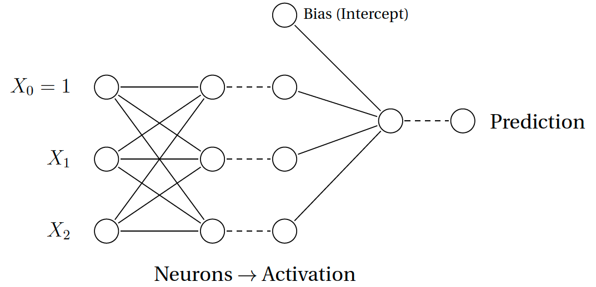

```{r setup}
# The first line sets an option for the final document that can be produced from
# the .Rmd file. Don't worry about it.
knitr::opts_chunk$set(echo = TRUE)

# The next bit (lines 50-69) is quite powerful and useful. 
# First you define which packages you need for your analysis and assign it to 
# the p_needed object. 
p_needed <-
  c("viridis", "knitr", "MASS", "pROC")

# Now you check which packages are already installed on your computer.
# The function installed.packages() returns a vector with all the installed 
# packages.
packages <- rownames(installed.packages())
# Then you check which of the packages you need are not installed on your 
# computer yet. Essentially you compare the vector p_needed with the vector
# packages. The result of this comparison is assigned to p_to_install.
p_to_install <- p_needed[!(p_needed %in% packages)]
# If at least one element is in p_to_install you then install those missing
# packages.
if (length(p_to_install) > 0) {
  install.packages(p_to_install)
}
# Now that all packages are installed on the computer, you can load them for
# this project. Additionally the expression returns whether the packages were
# successfully loaded.
sapply(p_needed, require, character.only = TRUE)
```

------------------------------------------------------------------------

# Program for today

In this session, we will learn about:

1. Models for Binary Dependent Variables

    - Logit Model
    - Probit Model
    - Standard Errors
    
2. Neural Networks

------------------------------------------------------------------------

# Models for Binary Dependent Variables: Logit, Probit and Neural Networks

We will discuss all topics about these models by the means of a real science example (and also some fake data). The data we will use is taken from a research article that criticizes the strong focus on statistical significance in large-n studies of conflict. 


Let's first load the dataset.

```{r}
load("raw_data/CW.RData")
head(fl.three) 
```

Today we are interested in the onset of civil war. For a first simple model, we will ask whether GDP per capita $(x_i)$ increases/decreases the probability of civil war ($y_i$). More formally, we will be estimating the following

$$
  Pr(y_i=1|x_i).
$$

That means that we will build and estimate a model of the probability of civil war onset, conditional on GDP.

You have seen several different approaches that motivate logit or probit models:

  - The Pure Probability Approach
  - The Latent Variable Approach
  - The Random Utility Approach

In this lab, we will take the random utility approach, which has connections to the latent variable approach. Mainly, because future additions to the logit model are easier to understand in this framework. 

For today, this means that we will interpret civil war onset as a choice by insurgents. Denote the rebels' utility of war (fighting) in country-year combination $i$ by $U^W_i(x_i)$ and the utility of peace (not fighting) by $U^P_i(x_i)$. Further, let there by a baseline utility for each alternative ($\alpha^W_0$ and $\alpha^P_0$) and *unobserved* factors that determine the rebels utility ($\mu^W_i$ and $\mu^P_i$). Then we can write

$$
\begin{aligned}
  U^W_i(x_i) &= \alpha^W_0 + \alpha^W_1 x_i + \mu^W_i \\
  U^P_i(x_i) &= \alpha^P_0 + \alpha^P_1 x_i + \mu^P_i
\end{aligned}
$$

Following this approach, rebels will start a civil war if war has a higher utility than peace. Or formally, if $U^W_i(x_i) > U^P_i(x_i)$, which is the case if $U^W_i(x_i) - U^P_i(x_i) > 0$. We can rearrange $U^W_i(x_i) - U^P_i(x_i)$ as follows:

$$
\begin{aligned}
  U^W_i(x_i) - U^P_i(x_i) &= (\alpha^W_0 + \alpha^W_1 x_i + \mu^W_i) - 
                              (\alpha^P_0 + \alpha^P_1 x_i + \mu^P_i) \\
    &= (\alpha^W_0 - \alpha^P_0) + (\alpha^W_1 - \alpha^P_1)x_i + (\mu^W_i-\mu^P_i)
\end{aligned}
$$

This allows us to define 

  - $\beta_0 = \alpha^W_0 - \alpha^P_0$
  - $\beta_1 = \alpha^W_1 - \alpha^P_1$, and 
  - $\epsilon_i = \mu^W_i - \mu^P_i$. 
  
Then, we model rebels as starting a civil war if

$$
\underbrace{\beta_0 + \beta_1x_i + \epsilon_i}_{U^W_i(x_i) - U^P_i(x_i)} > 0
$$

Given this, we define a "latent variable" $y_i^*$:

$$
  y^*_i(x_i;\beta_0,\beta_1) = \beta_0 + \beta_1x_i + \epsilon_i
$$

and express this latent variable as determining our outcome variable for the $i$th country-year combination

$$
  y_i = \begin{cases} 0 & \text{ if } y^*_i \leq 0 \\ 1 & \text{ if } y^*_i > 0 \end{cases}
$$

We are not in the position yet to estimate our object of interest. To do so, we need to make a distributional assumption about $\epsilon_i$. Note what that means. We make an assumption about the distribution of unobserved factors that add into the utility of the rebels. This is indeed not a straightforward choice.

We may assume that the unobservable $\epsilon_i$ has a logistic distribution (with location 0 and scale 1). This distribution has the following:

$$
  F(x) = \Lambda(x) = \frac{1}{1 + e^{-x}}
$$

With our distributional assumption we can now write the conditional probability of civil war onset.

$$
\begin{aligned}
  \underbrace{Pr(y_i=1|x_i;\beta_0,\beta_1)}_{\text{Prob. of Civil War given x}} 
      &= Pr(\beta_0 + \beta_1x_i + \epsilon_i \geq 0|x_i) \\
      &= Pr(-\epsilon_i \leq \beta_0 + \beta_1x_i|x_i) \\
      &= Pr(\epsilon_i \geq - (\beta_0 + \beta_1x_i)|x_i) \\
      &= 1 - Pr(\epsilon_i \leq - (\beta_0 + \beta_1x_i)|x_i) \\
      &= \Lambda(\beta_0 + \beta_1x_i) \\
      &= \frac{1}{1 + e^{-(\beta_0 + \beta_1x_i)}}  
\end{aligned}
$$

Now that we have modeled the systematic component of our model, the probability of civil war onset, what is left is replace it in the stochastic component and derive the log-likelihood. You have done this in the lecture. The log-likelihood is

$$
  ln L(\beta|y) = 
    \sum_{i=1}^{n} \left( y_i\cdot ln\left(\frac{1}{1+e^{-X_i\beta}}\right) + 
    (1-y_i)\cdot ln\left(1-\frac{1}{1+e^{-X_i\beta}}\right) \right)
$$

Let's think about the mechanics of this function for a moment: What is the purpose of $y_i$ and $(1-y_i)$ within this function?

$$
  ln L(\beta|y) = 
    \sum_{i=1}^{n} \left( \underbrace{y_i}_{=1\text{ if Civil War}\\=0\text{ if Peace}}\cdot ln
    \underbrace{\left(\frac{1}{1+e^{-X_i\beta}}\right)}_{\text{Pr(Civil War}|X_i)} + 
    \underbrace{(1-y_i)}_{=1\text{ if Peace}\\=0\text{ if Civil War}}\cdot ln 
    \underbrace{\left(1-\frac{1}{1+e^{-X_i\beta}}\right)}_{\text{Pr(Peace}|X_i)} \right)
$$

As we have seen in the last lab sessions, we love to translate these equations to functions in `R`:

```{r}
LLlogit <- function(theta, y, X) {
    
    # theta consists merely of beta (dim is ncol(X))
    beta <- theta[1:ncol(X)]
    # linear predictor; make sure that X is stored as.matrix
    mu <- X %*% beta
    # link function
    p <- 1/(1 + exp(-mu))
    # log-likelihood
    ll <- y * log(p) + (1 - y) * log(1 - p)
    # sum
    ll <- sum(ll)
    return(ll)
}
```

We have asked ourselves about the influence of GDP on the onset of civil war. We have everything we need to estimate it. What follows is, by now, standard procedure.

```{r}
# define variables
y <- fl.three$onset
X <- cbind(1, fl.three$gdpenl)

# start values
startvals <- c(0,0)

# optimize
res <- optim(par = startvals,
             fn = LLlogit, 
             y = y, 
             X = X,
             control = list(fnscale = -1),
             hessian = TRUE,
             method = "BFGS"
             ) 

res$par      
```

Given our small microeconomic model of civil war onset, we have a direct interpretation of the effect of GDP. Higher GDP per capita decreases the utility of war (or increases the utility of peace) for the rebels. Maybe because they have to give up their relatively decent living or because more effort is needed to recruit satisfied people to fight a war.

## Standard Errors...

Let's calculate the standard errors. We did this last week when we talked about ML estimation of linear regression models. It works exactly the same for logistic regression models. 

Who remembers what we have to do?

```{r Standard Errors..., eval=FALSE}

se <- ???

```


To be sure that our estimation is "correct", we can check with the implementation in `R`:

```{r, eval=FALSE}
res_glm <- glm(onset ~ gdpenl, 
               data = fl.three, 
               family = binomial(link = "logit"))

summary(res_glm)

results <- cbind(res$par, se)
rownames(results) <- c("Constant", "GDP")
colnames(results) <- c("Coef","SE")

results
```


As you remember from last semester, the interpretation of logit (or probit) coefficients is not easy. Next week we will talk in depth about simulation and quantities of interest. However, as you all know the concept already we will briefly use it here.

```{r}
# Get the variance-covariance matrix
varcov <- solve(-res$hessian)

# Set up the sampling distribution
library(MASS)
S <- mvrnorm(1000, res$par, varcov)

# Set interesting Covariate Values
values <- cbind(1, 
                c(quantile(fl.three$gdpenl, 
                           seq(0.1, 0.9, by = 0.10))))

# Calculate mu and p
mu <- S %*% t(values)
p <- 1/(1 + exp(-mu))

# Use botplots to visualize

boxplot(p,
        col = adjustcolor("white", 0),
        pch = 19,
        cex = 0.7,
        outcol = adjustcolor("black", 0.5),
        las = 1,
        ylab = "Predicted Probability for Civil War",
        xlab = "Quantiles of GDP")

# ... or points with confidence intervals

# means and confidence intervals
p_mean <- apply(p, 2, mean)
p_quant <- apply(p, 2, quantile, probs = c(0.025, 0.975))

x_vals <- seq(0.1, 0.9, by = 0.10)
plot(x = x_vals,
     y = p_mean,
     pch = 19,
     cex = 1.5,
     col = viridis(1),
     ylim = c(0, 0.04),
     las = 1,
     ylab = "Predicted Probability for Civil War",
     xlab = "Quantiles of GDP",
     xaxt = "n")
axis(1,
     at = x_vals,
     labels = colnames(p))
segments(x0 = x_vals,
         x1 = x_vals,
         y0 = p_quant["2.5%",],
         y1 = p_quant["97.5%",],
         col = viridis(1),
         lwd = 3,
         lend = 1)
```

## Exercise I: The Probit Model

Write down the log-likelihood function for a probit model and estimate the parameters. Then calculate predicted probabilities and compare them to the predicted probabilities in the logit model. 

This is the log likelihood function:

$$
ln L(\beta|y) = \sum_{i=1}^{n} ( y_i \cdot ln(\Phi(X_i\beta)) + (1-y_i) 
\cdot ln(\Phi(-X_i\beta))) 
$$

Hint 1: You can start with the `LLlogit()` function from above. The probit model only differs from the logit model in its link-function.

Hint 2: $\Phi(\cdot)$ is the CDF of the normal, which is just `pnorm()` in `R`.

```{r Exercise I: The Probit Model, eval = FALSE}

LLprobit <- function(theta, y, X) {
    
    # theta consists merely of beta (dim is ncol(X))
    beta <- ???
    # linear predictor; make sure that X is stored as.matrix
    mu <- ???
    # link function
    p <- ???
    # log-likelihood
    ll <- ???
    # sum
    ll <- ???
    return(ll)
}


# Once you are done, you can estimate the model:

# define variables
y <- fl.three$onset
X <- cbind(1,fl.three$gdpenl)

# initial values
startvals <- c(0, 0)

# optimize
res <- optim(par = startvals, 
             fn = LLprobit, 
             y = y, 
             X = X,
             control = list(fnscale = -1), hessian = TRUE,
             method="BFGS"
             ) 

```

# Neural Networks

In the lecture you learned that now we have everything to implement really fancy models. For example **scobit models** or **neural networks**. 

You probably didn't believe, that you can actually implement those. 

Yes, we can! 

We will start with a motivating example with fake data. And then apply our neural network to the civil war dataset. 


```{r}
nnData <- readRDS("raw_data/nnData.RDS")

nnData <- nnData[sample(1:nrow(nnData), 1000), ]

y <- nnData[, 1]

head(nnData, 15)

```

Ok, so `y` is a binary dependent variable, and we have two independent variables `x1` and `x2`.

Let's plot it:

```{r}

col <- y
col[y == 1] <- viridis(3, 0.4)[1]
col[y == 0] <- viridis(3, 0.4)[2]

plot(nnData[,2], 
     nnData[,3], 
     col = col, 
     pch = 19,
     xlab = "x1", 
     ylab = "x2",
     main = "Observed values of y conditional on X",
     font.main = 1,
     bty = "n",
     las = 1)
legend("topleft",
       legend = c("y = 1", "y = 0"),
       pch = 19,
       col =  viridis(3, 0.4)[1:2],
       bty = "n")

```

**What do you think: How would a naive logit model divide the data?**

Let's find out:

## Start with a logit model 

Run a simple logit model with y as the dependent variable and `x1` and `x2` as independent variables.
Calculate fitted values $\hat y$. 

Plot `x1` against `x2` and color the points according to the fitted values (purple for $\hat y = 1$ and cyan for $\hat y = 0$ )

```{r Logit model}

LLlogit <- function(theta, y, X) {
    
  # theta consists merely of beta (dim is ncol(X))
    beta <- theta[1:ncol(X)]
    # linear predictor; make sure that X is stored as.matrix
    mu <- X %*% beta
    # link function
    p <- 1/(1 + exp(-mu))
    # log-likelihood
    ll <- y * log(p) + (1 - y) * log(1 - p)
    # sum
    ll <- sum(ll)
    return(ll)
}

# define variables
y <- nnData[, 1]
X <- cbind(1, nnData[,2:3])

# initial values
startvals <- c(0,0,0)

# optimize
res <- optim(par = startvals,
             fn = LLlogit, 
             y = y, 
             X = X,
             control = list(fnscale = -1),
             hessian = TRUE,
             method = "BFGS"
             ) 

mu <- X %*% res$par
    
# link function
p <- 1/(1 + exp(-mu))

y_hat <- ifelse(p > 0.5, 1, 0)

```

```{r}
par(mfrow = c(1, 2))

# Lets start with observed values of y
col_o <- y
col_o[y == 1] <- viridis(3, 0.4)[1]
col_o[y == 0] <- viridis(3, 0.4)[2]

plot(nnData[,2], 
     nnData[,3], 
     col = col_o, 
     pch = 19,
     xlab = "x1", 
     ylab = "x2",
     main = "Observed y conditional on X",
     font.main = 1,
     bty = "n",
     las = 1)
legend("topleft",
       legend = c("y = 1", "y = 0"),
       pch = 19,
       col =  viridis(3, 0.4)[1:2],
       bty = "n")

# and add predicted values based on our logit model

col_p <- y_hat

col_p[y_hat == 1] <- viridis(3, 0.4)[1]
col_p[y_hat == 0] <- viridis(3, 0.4)[2]

plot(x = X[, 2], 
     y = X[, 3], 
     col = col_p, 
     pch = 19,
     xlab = "x1", 
     ylab = "x2",
     main = "Logit predictions\nof y conditional on X",
     font.main = 1,
     bty = "n",
     las = 1)
legend("topleft",
       legend = c("y = 1", "y = 0"),
       pch = 19,
       col =  viridis(3, 0.4)[1:2],
       bty = "n")
```

That's a bit disappointing.

So we want to set up a neural network model that does a better job.

Remember from the lecture how we could write our logit model: 

$$
Pr(Y_i = 1) 
  = \pi_i 
  = \frac{1}{1+e^{-X_i\beta}} 
  = logit(X_i\beta) 
  = logit(linear(X_i))
$$

Now we can extend this and add another "layer", so that: 

$$
  Pr(Y_i = 1) 
    = \pi_i 
    = logit(linear(logit(linear(X_i))))
$$

In biostats this kind of model is called a "single hidden layer feed-forward perceptron". Sounds complicated but really *just* is a **linear model in a logit model in a linear model in a logit model**. Such a model allows for highly interactive and nonlinear relationships.

We can also depict this in a way that is more similar to how neural networks are ususally visualized:



In the end the likelihood we want to maximize is really just the likelihood of a logit. Let's program this together.

```{r}

LLSimpleNeural <- function(theta, y, X){
  
  gamma <- theta[1:4]
  beta_neuron1 <- theta[5:7]
  beta_neuron2 <- theta[8:10]
  beta_neuron3 <- theta[11:13]
  
  # Step 1: Connect the Input to the single layer of neuron
  # -> we have two input variables (plus intercept)
  # -> we have three neurons.
  # -> each input is connect to each neuron
  mu_neuron1 <- X %*% beta_neuron1
  mu_neuron2 <- X %*% beta_neuron2
  mu_neuron3 <- X %*% beta_neuron3
  
  # Step 2: Nonlinear activation
  # This is just the logit response function
  # (...or the so-called "Sigmoid activation function")
  logitResponse <- function(mu) 1/(1+exp(-mu))
  
  p_neuron1 <- logitResponse(mu_neuron1)
  p_neuron2 <- logitResponse(mu_neuron2)
  p_neuron3 <- logitResponse(mu_neuron3)
  
  # Step 3:
  # Connect the activated neurons to the final neuron
  Z <- cbind(1, p_neuron1, p_neuron2, p_neuron3)
  
  mu <- Z %*% gamma
  
  # activate again
  p <- logitResponse(mu)
  
  ll <- y * log(p) + (1 - y) * log(1 - p)
  
  ll <- sum(ll)
  return(ll)
}
```

Let's put this to work

```{r}
y <- nnData[, 1]
X <- cbind(1, nnData[, 2:3])

# initial values
set.seed(1234)
startvals <- rnorm(13)

# see wether the function works
LLSimpleNeural(startvals, y, X)

# optimize
resNN <- optim(par = startvals, 
               fn = LLSimpleNeural, 
               y = y, 
               X = X,
              control = list(fnscale = -1),
              hessian = F,
              method = "BFGS"
              ) 

resNN$par

gammaEst <- resNN$par[1:4]
beta_neuron1Est <- resNN$par[5:7]
beta_neuron2Est <- resNN$par[8:10]
beta_neuron3Est <- resNN$par[11:13]
```


To get to fitted values $\hat y$ we first have to calculate the $\mu_{neuron_i}$:

```{r}

mu_neuron1Est <- X %*% beta_neuron1Est
mu_neuron2Est <- X %*% beta_neuron2Est
mu_neuron3Est <- X %*% beta_neuron3Est

```

Then we put these $\mu_{neuron_i}$ through the logit response function:

```{r}

logitResponse <- function(mu) 1/(1+exp(-mu))

p_neuron1Est <- logitResponse(mu_neuron1Est)
p_neuron2Est <- logitResponse(mu_neuron2Est)
p_neuron3Est <- logitResponse(mu_neuron3Est)

```

These $\pi_{neuron_i}$ values are now the input to the linear component

$$
  \mu = \gamma_0 + \gamma_1 * \pi_{neuron_1} + \gamma_2 * \pi_{neuron_2} + \gamma_3 * \pi_{neuron_3}
$$

```{r}

Z <- cbind(1, p_neuron1Est, p_neuron2Est, p_neuron3Est )

mu <- Z %*% gammaEst

p <- logitResponse(mu)

y_hat_nn <- ifelse(p > 0.5, 1, 0)
```

Now putting this $\mu$ in the logit response function gives us predicted probabilities. We can transform these probabilities to $\hat y$ just as in the logit model and plot it.

```{r}


par(mfrow = c(1, 3))

# Lets start with observed values of y
col_o <- y
col_o[y == 1] <- viridis(3, 0.4)[1]
col_o[y == 0] <- viridis(3, 0.4)[2]

plot(nnData[,2], 
     nnData[,3], 
     col = col_o, 
     pch = 19,
     xlab = "x1", 
     ylab = "x2",
     main = "Observed y conditional on X",
     font.main = 1,
     bty = "n",
     las = 1)
legend("topleft",
       legend = c("y = 1", "y = 0"),
       pch = 19,
       col =  viridis(3, 0.4)[1:2],
       bty = "n")

# and add predicted values based on our logit model

col_p <- y_hat

col_p[y_hat == 1] <- viridis(3, 0.4)[1]
col_p[y_hat == 0] <- viridis(3, 0.4)[2]

plot(x = X[, 2], 
     y = X[, 3], 
     col = col_p, 
     pch = 19,
     xlab = "x1", 
     ylab = "x2",
     main = "Logit predictions\nof y conditional on X",
     font.main = 1,
     bty = "n",
     las = 1)
legend("topleft",
       legend = c("y = 1", "y = 0"),
       pch = 19,
       col =  viridis(3, 0.4)[1:2],
       bty = "n")

# and the predictions by our simple neural net

col_nn <- y_hat_nn

col_nn[y_hat_nn == 1] <- viridis(3, 0.4)[1]
col_nn[y_hat_nn == 0] <- viridis(3, 0.4)[2]

plot(X[, 2], 
     X[, 3], 
     col = col_nn, 
     pch = 19,
     xlab = "x1", 
     ylab = "x2",
     main = "Neural Net predictions\nof y conditional on X",
     font.main = 1,
     bty = "n",
     las = 1)
```

Ok so this function was very specific to the fake data input. So here is a more general function for you:

```{r}
LLneural <- function(theta, neurons, y, X) {
  
  k <- ncol(X)
  n <- nrow(X)
  # theta consists merely of beta (dim is ncol(X))
  gamma <- theta[1:(neurons+1)]
  beta <- matrix(theta[(neurons+2):(neurons+1+neurons*k)], 
                 neurons, 
                 k, 
                 byrow = T)
  
  log <- matrix(NA, n, neurons)
  for(i in 1:neurons){
   log[,i] <- X%*%beta[i,]
  }
  
  p <- function(mu) 1/(1 + exp(-mu))
  
  p_log <- matrix(NA, n, neurons)
  
  for(i in 1:neurons){
    p_log[,i] <- p(log[,i])
  }
  
  Z <- cbind(1, p_log[,1:neurons])
  
  mu <- Z %*% gamma
  
  pfin <- p(mu)
  
  # log-likelihood
  ll <- y * log(pfin) + (1 - y) * log(1 - pfin)
  # sum
  ll <- sum(ll)
  return(ll)
}

```

Let's put it to work. We can use more neurons now:

```{r}
neurons <- 5

npar <- neurons+1+neurons*ncol(X)

set.seed(2204)
startvals <- rnorm(npar)

LLneural(startvals, neurons = neurons, y, X)

res.neural <- optim(neurons = neurons, 
                    X = X, 
                    y = y, 
                    fn = LLneural, 
                    method = "BFGS", 
                    control = list(fnscale = -1), 
                    par = startvals, hessian = F)


gammaEst <- res.neural$par[1:(neurons+1)]

betaEst <- matrix(res.neural$par[(neurons+2):(neurons+1+neurons*ncol(X))], 
                  neurons, 
                  ncol(X), 
                  byrow = T)

mu_neuronEst <- matrix(NA, nrow(X), neurons)
for(i in 1:neurons){
  mu_neuronEst[,i] <- X %*% betaEst[i,]
}


p_neuronEst <- matrix(NA, nrow(X), neurons)

for(i in 1:neurons){
p_neuronEst[,i] <- logitResponse(mu_neuronEst[,i])
}

Z <- cbind(1, p_neuronEst[,1:neurons])

muEst <- Z %*% gammaEst

pEst <- logitResponse(muEst)

y_hat_nn <- ifelse(pEst > 0.5, 1, 0)

col_nn <- y_hat_nn

col_nn[y_hat_nn == 1] <- viridis(3, 0.4)[1]
col_nn[y_hat_nn == 0] <- viridis(3, 0.4)[2]

plot(X[, 2], 
     X[, 3], 
     col = col_nn, 
     pch = 19,
     xlab = "x1", 
     ylab = "x2",
     main = "Neural Net predictions\nof y conditional on X",
     font.main = 1,
     bty = "n",
     las = 1)
```


Now we can use this general function to estimate the probability of civil war onset using a neural network. We use all the variable in the data set to predict civil war and start with a neural network that has 5 neurons (but you can play around with this).

```{r Neural Network and Civil War onset}

y <- fl.three$onset

X <- cbind(1,  
           fl.three$warl, 
           fl.three$gdpenl, 
           fl.three$lmtnest, 
           fl.three$ncontig,
           fl.three$Oil, 
           fl.three$nwstate, 
           fl.three$instab, 
           fl.three$polity2l, 
           fl.three$ethfrac, 
           fl.three$relfrac)


# Set up our neural net

neurons <- 5

npar <- neurons + 1 + neurons*ncol(X)

startvals <- rnorm(npar)

LLneural(startvals, 
         neurons = neurons, 
         y = y, 
         X = X)

res.neural <- optim(neurons = neurons, 
                    X = X, 
                    y = y, 
                    fn = LLneural, 
                    method = "BFGS", 
                    control = list(fnscale = -1), 
                    par = startvals, 
                    hessian = F)


# use the coefficients (or "weights") to get predictions 
# NOTE: we are not doing out of sample prediction

gammaEst <- res.neural$par[1:(neurons+1)]

betaEst <- matrix(res.neural$par[(neurons+2):(neurons+1+neurons*ncol(X))], 
                  neurons, ncol(X), 
                  byrow = T)

mu_neuronEst <- matrix(NA, nrow(X), neurons)

for(i in 1:neurons){
  mu_neuronEst[,i] <- X %*% betaEst[i,]
}


p_neuronEst <- matrix(NA, nrow(X), neurons)

for(i in 1:neurons){
  p_neuronEst[,i] <- logitResponse(mu_neuronEst[,i])
}

Z <- cbind(1, p_neuronEst[,1:neurons])

muEst <- Z %*% gammaEst

pEst <- logitResponse(muEst)

y_hat_nn <- ifelse(pEst > 0.5, 1, 0)


# so now we can check how well we can predict y 
# (again: this is in-sample prediction)

table(actual = y,
      predicted = y_hat_nn)


# how well would a simple logit do?

res.glm <- glm(fl.three$onset ~ fl.three$warl + 
                 fl.three$gdpenl + 
                 fl.three$lmtnest + 
                 fl.three$ncontig + 
                 fl.three$Oil + 
                 fl.three$nwstate + 
                 fl.three$instab + 
                 fl.three$polity2l + 
                 fl.three$ethfrac + 
                 fl.three$relfrac,  
               family = binomial(link = "logit"))

y_hat_logit <- ifelse(res.glm$fitted.values > 0.5, 1, 0)

table(actual = y, 
      predicted = y_hat_logit)


# We plot a ROC curve to evaluate how well the model
# predicts civil war onset and compare it to predictions
# of the simple logit regression model
plot(roc(y, as.vector(pEst)),
     col = viridis(3)[1], xlim = c(1.55, -0.55))
lines(roc(y, res.glm$fitted.values),
      col = viridis(3)[2])
segments(x0 = 1, y0 = 0, x1 = 1, y1 = 1, col = "black", lwd = 2, lty = 2)
segments(x0 = 1, y0 = 1, x1 = 0, y1 = 1, col = "black", lwd = 2, lty = 2) 
text(x = 0.85, y = 0.90, labels = "Perfect model", pos = 4, cex = 0.6)
arrows(x0 = 0.85, y0 = 0.9, x1 = 1, y1 = 1, col = "black", lwd = 2, length = 0.1)
text(x = 0.7, y = 0.15, labels = "No predictive power", pos = 4, cex = 0.6)
arrows(x0 = 0.5, y0 = 0.2, x1 = 0.5, y1 = 0.5, col = "black", lwd = 2, length = 0.1)
legend("topleft",
       legend = c("Neural Net",
                  "Simple Logit"),
       lwd = 2,
       col = viridis(3)[1:2],
       bty = "n")
```

*Sensitivity*: Proportion of correctly predicted civil wars (True positive rate)
*Specificity*: Proportion of correctly predicted absence of civil war (True negative rate)

# Concluding Remarks

Six weeks into AQM and -- more or less as a by-product -- we coded up our own neural network (and we can actually understand what's going on inside of it). I think that's awesome!


